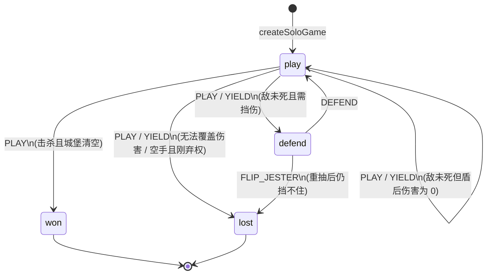

# Regicide / 弑君者 (H5)

移动端弑君者 — Vite + React + TypeScript 6 + **Phaser 4**。

## 分层

| 层 | 路径 | 职责 |
|---|---|---|
| **core** | `src/core` | 单人规则引擎（显式状态机） |
| **orchestration** | `src/orchestration` | 会话 / 意图 / 存档 |
| **game** | `src/game` | Phaser 场景与卡牌表现 |
| **ui** | `src/ui` | React 全屏挂载 |

界面文案统一中文（`src/game/i18n/zh.ts`）。

## Core 状态机

规则入口：`applyAction`（`src/core/machine.ts`）。状态就是 `GameState.phase`。

| 状态 | 合法动作 |
|---|---|
| `play` | `PLAY` / `YIELD` / `FLIP_JESTER` |
| `defend` | `DEFEND` / `FLIP_JESTER` |
| `won` / `lost` | 无（终态） |



ASCII 对照（与 `machine.ts` 顶部注释一致）：

```
                   PLAY (敌死 · 城堡空)
              ┌──────────────────────────────────► won
              │
              │ PLAY (敌死 · 还有下一敌)
              │ PLAY / YIELD (伤害被盾减到 0)
              │ DEFEND
  ┌──────┐    │         ┌────────┐
  │ play │◄───┴─────────│ defend │
  └──┬───┘              └───┬────┘
     │                      │
     │ PLAY / YIELD         │ FLIP_JESTER 后仍挡不住
     │ (敌存活且需挡伤)      │ 或无法行动
     └──────────────────────┘
              │
              ▼
             lost
```

读代码顺序：

1. `machine.ts` — 状态图、`PHASE_ACTIONS`、按 phase 分发
2. `handlers.ts` — 各 action 的规则
3. `transitions.ts` — 换 phase 的箭头（`enterDefendOrFinish` / `defeatEnemy` / …）

## 脚本

```bash
npm run dev
npm test
npm run build
node scripts/qa-browser.mjs
```
