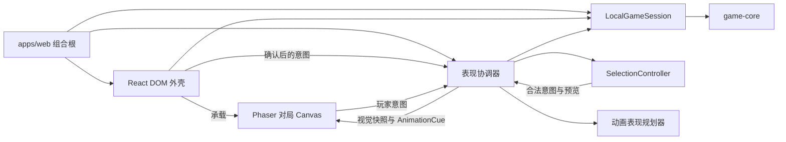

# H5 UI 架构

## 范围与所有权

v1 UI 只支持 Android 手机上的最新稳定版 Google Chrome。浏览器产品位于未来的 `apps/web`，依赖 `game-application`，但 Phaser、React、DOM 和浏览器适配器都不得进入 `game-core` 或 `game-application`。

`LocalGameSession` 是唯一会话事实源。React 通过 `useSyncExternalStore` 订阅不可变的 `SessionSnapshot` 以选择生命周期页面；Phaser 不直接订阅会话，只从表现协调器取得视觉快照和动画提示。玩家操作只能提交 `PlayerIntent`；选牌、弹窗、交互阻断原因和动画进度属于瞬时表现状态。恢复存档只渲染当前快照，不回放历史事件。

未来的 `apps/web` 使用 Vite、React 和 TypeScript 构建为静态单页应用。v1 不引入客户端路由或 Service Worker；Phaser 通过动态 `import()` 形成独立 chunk，静态资源使用带内容哈希的 manifest。依赖固定精确版本，CI 从生产构建产物检查 chunk 与首次可操作资源预算。

静态托管让 `index.html` 每次重验证，带内容哈希的 JS、CSS、资源 manifest、图集、插画和音效使用一年 immutable 缓存。发布先上传并验证全部新资源，再原子切换 HTML，旧哈希资源至少保留 30 天。旧页面仍无法加载延迟 chunk 或 manifest 时，DOM 提供“刷新加载新版”操作；刷新只重建页面并重新读取会话，不清理自动存档。

UI 不提供全局 `lock/unlock`。会话、渲染器、动画、DOM 模态层、页面前后台、方向和视口分别拥有独立阻断原因；纯交互门面将完整原因集合与只读选择快照合并，派生 `canSelectCards`、`canSubmitIntent`、`canFastForward` 与外壳操作能力。Canvas 和 TalkBack 语义层读取同一深只读能力快照，提交前协调器再次校验；每个流程只能清除自己的阻断原因。

表现协调器内部的 `SelectionController` 是选中 `CardId` 集合的唯一所有者。它只持有瞬时选择，从最新快照和合法意图集合派生可加入卡牌、完整意图和预览，并向 Canvas 与语义控制层发布只读选择快照；React 不保存选牌，Phaser 不保存选牌。

## 渲染边界

React 负责 `no-game`、`unrecoverable-save`、`load-failed` 和 `stale` 等会话页面，以及确认、错误、终局结算和旋转设备遮罩。Phaser `4.2.1` 只负责 `active` 对局中的牌桌、卡牌、敌人、触控命中和提交事件动画；DOM 不绘制或移动游戏对象，覆盖层打开时设置 `modal` 阻断原因。

当 `active.game.status` 为 `won` 或 `lost` 时，Phaser 保留冻结的最终牌桌并关闭全部 Canvas 玩家输入，React 在其上显示胜负、单人评级和开始新局操作。刷新后仍恢复该最终局面与结算，只有玩家确认后才调用 `replaceWithNewGame`。

Phaser 固定使用 WebGL，不启用 WebGPU 或 Canvas 2D 回退。v1 只提供竖屏可玩布局；横屏显示 DOM 遮罩并设置 `orientation` 阻断原因。页面不请求 Fullscreen API 或 `screen.orientation.lock()`，也不为其成功或失败增加流程状态。竖屏 Canvas 跟随实际可视区域重新布局，不使用固定比例黑边；敌人、战场和手牌区域按可用空间排列，视觉与命中尺寸设置上下限，内部渲染像素比最高为 `2`。

最低可玩竖屏视觉视口为 `320 × 568 CSS px`，任一维度更小时显示 DOM 尺寸不足遮罩并设置 `viewport` 阻断原因。页面使用动态视口高度和安全区 inset，viewport 配置不得禁止用户缩放。自动化至少覆盖 `320`、`360`、`412` 和 `480 CSS px` 宽度，以及动态地址栏伸缩和横竖切换。

牌桌常驻紧凑 HUD，显示敌人位阶与花色、攻击、当前与总生命、护盾和花色免疫状态，城堡、酒馆与弃牌区数量，Solo Jester 剩余次数，以及当前选择的攻击或承伤预览。所有数值从最新会话快照和应用层只读查询派生；城堡与酒馆等暗区只显示数量，不显示卡牌身份。同一公开摘要进入 TalkBack 语义控制层。

牌桌的信息图标随时打开 DOM 规则参考面板，集中说明合法组合、四种花色效果、敌方花色免疫、反击弃牌、让牌、Solo Jester 和单人胜利评级。内容来自统一的简体中文消息目录，不读取或改变当前对局；面板打开时设置 `modal` 阻断原因，关闭时只清除自己的阻断并返回原有焦点和选择状态。v1 不自动打开帮助，不提供首次进入教程、引导标记或强制教学局，也不保存一次性引导状态。

运行中丢失 WebGL 上下文时，UI 设置 `renderer` 阻断原因并快进当前动画批次。上下文恢复后销毁旧表现状态，只从最新 `SessionSnapshot` 重建 Phaser 场景，不回放已经提交的事件；重建成功后只清除 `renderer`，自动恢复失败时显示保留会话与存档的 DOM 重试页。

## 玩家意图

手牌通过点击切换选中状态，再由明确的出牌或弃牌按钮提交；拖拽不是必要操作。UI 每次从 `getLegalPlayerIntents` 取得完整合法意图集合，不复制组合规则：取消已选牌始终允许，只有加入后仍是某个合法意图子集的牌可以继续选择，提交按钮仅在当前选择本身匹配合法意图时启用。

最多八张手牌在 Canvas 中使用单行、非重叠、可横向滚动的卡带，视觉顺序始终跟随 `game.players[0].hand`。点击选中后卡牌上抬，底部操作栏固定在滚动区域之外；选择、取消和滚动都不改变牌序，v1 不提供扇形重叠、拖拽重排或自定义排序。

一次操作返回 `committed` 时由 `SelectionController` 立即清空选择。`storage-error` 保留选择，让玩家关闭错误提示后重试；core `rejected`、`application-rejected` 或会话状态变化时由控制器清空选择并按最新快照重绘。

两张 Solo Jester 在规则上只有身份不同，UI 将它们呈现为一个带剩余次数的操作，不要求玩家选择具体 Jester。触发时控制器将合法的 `use-solo-jester` 意图按 `cardId` 升序排列并选择第一个，不依赖 `getLegalPlayerIntents` 的枚举顺序；应用层现有的 `cardId` 契约保持不变。使用前始终显示 DOM 确认弹窗，明确将弃掉全部手牌并显示剩余次数；取消保留当前选择，确认后才提交意图。

让牌同样先显示 DOM 确认弹窗，并展示即将承受的反击伤害；取消保留当前选择，确认后才提交 `yield`。出牌和弃牌以“选择后点击提交按钮”作为确认，不再增加第二层弹窗。

反击弃牌完全由玩家选择。UI 实时显示需要承受的伤害、已选牌点数和超出点数，但不自动选择或推荐组合；同点数牌仍可能具有不同的后续策略价值。

合法出牌选择在提交前显示应用层提供的公开意图预览，包括攻击值、触发花色、敌人预计剩余生命或精确击败、预计反击伤害和抽牌数量。预览不调用 UI 侧 `dispatch`，不改变状态或随机进度，也不提前揭示将抽到或移回牌库的具体卡牌。

应用层以纯函数 `previewPlayerIntent(game, intent): PlayerIntentPreview | null` 预览一个完整意图；结果按意图类型区分并深冻结，对传入 `game` 不合法的意图返回 `null`。纯查询不能识别传入快照本身是否已过期，因此 UI 在 `SessionSnapshot` 引用变化时丢弃旧选择与预览，并始终用最新 `active.game` 重算。部分选牌及仍可加入的卡牌继续从 `getLegalPlayerIntents` 推导，不由预览接口管理。

## 提交事件动画

只有 `committed` 结果携带的有序提交事件进入动画队列。应用状态和自动存档已经完成提交，动画层只表现结果；拒绝、存储失败和恢复存档都不播放事件动画。

表现协调器是 Phaser 的唯一数据入口。它在调用 `execute` 前捕获提交前只读快照；会话同步通知订阅者时不把新快照直接送入 Scene，等操作返回 `committed` 后再校验并建立提交前到提交后的动画批次。协调器只保留只读快照引用、动画批次和对 `SelectionController` 的组合，不复制 `GameState`。任何不属于当前操作的快照变化都会丢弃旧批次，由 React 按最新会话状态继续呈现。

Phaser 之外的纯 UI 表现规划器接收提交前快照、有序提交事件和提交后快照，生成不可变的 `AnimationCue[]`。cue 只包含提示类型、公开卡牌 ID 或数量和时长等级，不包含像素坐标、Phaser 对象或 Tween 实例；Scene 在每条 cue 开始时按当前布局解析位置。Phaser Scene 不直接解释 `GameEvent`；映射在编译期对已知事件保持穷尽，运行时遇到未知或无法规划的事件时跳过整个批次并直接呈现提交后快照。视口、方向或渲染上下文变化使布局失效时也废弃整个批次，不继续播放基于旧布局的动画。

动画队列未清空时设置 `animation` 阻断原因以拒绝新的玩家意图。玩家可以快进当前整组动画，页面进入后台时也执行相同快进；两种情况都停止瞬时动画、按最新会话快照重绘并只清除 `animation`，不撤销事件、规则状态、触发事件回放或清除其他阻断原因。

普通操作的动画设计目标不超过 `1.2 秒`；包含敌人击败、揭示或胜负结算的整个批次以墙钟时间 `2.5 秒` 为硬上限，到期直接对齐提交后快照。多张抽取和弃置使用并行或短错峰，不得让批次时长随卡牌数量线性增长。快进能力从 `animation` 阻断开始即对触控和 TalkBack 可用。

系统启用 `prefers-reduced-motion: reduce` 时，取消位移、缩放、震动和粒子动画，直接对齐最新快照，仅保留不超过 `150 毫秒` 的状态淡变与文字反馈。普通模式继续使用完整动画和快进控制。

v1 提供简短音效：选牌音效可立即播放，出牌、抽牌、受伤、击败敌人和胜负结算音效只随已提交事件播放；规则拒绝和存储失败不播放成功音效。首次访问默认开启音效，但只在玩家首次明确操作后播放；扬声器图标可以静音，偏好保存在独立的 UI 设置键中，不进入游戏自动存档。v1 不提供背景音乐，但保留以后增加独立音乐通道的可能。

## 页面生命周期

幂等的页面生命周期协调器统一处理 `visibilitychange`、`pagehide`、`pageshow`、`freeze` 和 `resume`。进入后台或冻结时设置 `background` 阻断原因、快进当前动画批次，并暂停 Phaser 循环与音频；恢复时重新测量视口，先读取最新 `SessionSnapshot`，再按 `active`、`stale` 或其他会话状态重绘相应页面，最后只清除 `background`。WebGL 上下文需要重建时继续使用既定的最新快照恢复路径。

重复、乱序或同时到达的生命周期事件不得重复播放动画、音效或调用会话操作。规则状态已经按 save-before-commit 契约持久化，页面不依赖 `unload` 或 `beforeunload` 保存，也不显示离页确认。

## 性能

Phaser 在触控响应和动画播放阶段以最高 `60 FPS` 运行；动画队列为空且无触控活动时降到 `15 FPS`，收到触控或开始动画时立即恢复。v1 不跟随 90/120 Hz 屏幕持续高刷，响应式布局继续将内部渲染像素比限制在 `2`。

性能验收以 Pixel 6a 级别的真实 Android 手机运行最新稳定版 Google Chrome 为最低基准。Playwright 设备模拟只验证视口、响应式布局和交互流程；WebGL 帧率、触控反馈延迟、内存占用和长时间运行稳定性必须在真机上测量。

真机使用固定种子的代表性操作循环验收：活动阶段 `p95` 帧间隔不超过 `20 ms`，超过 `50 ms` 的长帧少于 `1%`；点击到首个视觉反馈的 `p95` 不超过 `100 ms`；按解码像素与 mipmap 计算的常驻 WebGL 纹理不超过 `96 MiB`。从预热并回收后的基线连续运行 30 分钟，保留 JS 堆增长不超过 `10 MiB`，结束时帧表现相对开始时退化不超过 `10%`；空闲实际渲染频率保持在 `15 ± 2 FPS`。加载、页面后台和 WebGL 上下文重建区间单独统计。

React DOM 外壳首先加载并初始化 `LocalGameSession`。只有恢复出 `active` 对局或玩家确认开始新局时才动态加载 Phaser 与当前局面需要的素材；牌桌可操作后再后台预取其余插画和音效。无对局、不可恢复存档和加载失败页面不下载完整游戏运行时。

从 `no-game` 开始新局或替换当前局时，UI 先加载 Phaser chunk、成功初始化 WebGL，并取得包含基础卡框、四种花色符号和必要状态图标的关键图集，之后才调用 `startNewGame` 或 `replaceWithNewGame`。可选插画与音效不阻塞提交；核心显示链路加载失败时不创建新存档，也不替换旧存档。

Phaser chunk、WebGL 初始化、资源 manifest 或关键图集失败时，DOM 外壳显示重试并完整保留会话与存档。单张插画或音效失败时分别使用无插画卡面或静音降级，不阻止继续游戏；资产加载结果不改变规则状态。

冷缓存生产构建必须满足以下实际网络传输预算：React DOM 外壳的 JS 与 CSS gzip 传输不超过 `150 KiB`，Phaser 与游戏代码 chunk 的 gzip 传输不超过 `500 KiB`，首次就绪所需字体、图像和音效按生产编码后的实际传输字节计算且不超过 `1.5 MiB`，冷启动至就绪的总传输量不超过 `2.2 MiB`。

加载验收使用独立的 `shell-ready` 与 `game-ready` 性能标记。React DOM 外壳从页面导航开始，到会话状态和对应 DOM 控件可响应为止，冷缓存 `p95` 不超过 `1.5 秒`。恢复已有 `active` 对局时，`game-ready` 从页面导航开始；开始或替换新局时，从玩家确认操作开始并要求会话已成功提交。牌桌冷缓存 `p95` 不超过 `5 秒`，暖缓存 `p95` 不超过 `2 秒`。

测试通过生产 HTTPS 构建执行，网络固定为下行 `10 Mbps`、上行 `2 Mbps`、往返延迟 `100 ms` 且不人工注入丢包。冷缓存只清除 HTTP 缓存并在计时前注入固定测试存档，暖缓存复用已经填充的 HTTP 缓存；两者各执行 20 次，以 `performance.mark` 记录相应就绪点并要求 `p95` 达标。

计时从前述页面导航或新局确认起点持续到对局就绪。进行中对局以当前局面完整呈现且第一个合法玩家操作可以获得反馈为就绪；已结束对局以最终牌桌和可响应的 DOM 结算操作完整呈现为就绪。后台预取的可选插画和音效不属于完成条件。

## 视觉资产

v1 使用原创卡面视觉系统，不复制商业版 Regicide 卡图。数字牌使用原创框架、花色与排版，动物伙伴、Royal 和 Jester 使用原创插画；所有构图和细节密度以竖屏手机上的缩略尺寸辨识为先。整体采用现代纹章版画方向，以清晰剪影、粗线刻印质感、有限但高对比的套色和稳定卡框取代像素画或写实绘画。

四种花色分别使用不同强调色，但始终同时显示独立花色符号和文字标签。合法性、免疫、选中与禁用状态还要使用图形、描边或明暗变化，任何规则与交互状态都不能只靠颜色区分。

DOM 与 Canvas 的普通功能文字对比至少为 `4.5:1`，大号文字至少为 `3:1`，操作边界、图标和状态标记至少为 `3:1`。原创插画视为装饰内容，但叠加其上的位阶、花色和规则状态使用独立、达标的视觉 token。

v1 只提供简体中文，但所有界面文字集中在单一消息目录中，不引入完整国际化框架。原创插画不包含任何语言文字；卡牌位阶、花色和状态标签由运行时叠加，未来增加语言时不需要重新生成插画。

功能性中文使用 Android 系统无衬线字体，不下载完整中文 Web Font。数字、`J/Q/K` 和标题可以使用一个小型展示字体子集；花色符号使用独立图形资源，不依赖字体提供的字形。

基础卡框、四种花色符号和必要状态图标组成一个关键无损图集，卡牌位阶与文字由运行时叠加。每张可选插画使用独立、带内容哈希的 WebP；短音效统一使用 Opus/WebM。构建生成类型化 manifest，记录逻辑 ID、哈希 URL、像素尺寸和 `required` 或 `optional` 分类，并校验尺寸与传输预算。

## 可访问性

Android TalkBack 的完整可玩性属于 v1 验收范围。Phaser Canvas 是唯一视觉牌桌并对辅助技术隐藏；React 提供非视觉 DOM 语义控制层，以与手牌顺序一致的切换按钮暴露卡牌位阶、花色、点数、可选与选中状态，同时提供公开敌人状态和当前可用操作。语义层与 Canvas 共用表现协调器、`getLegalPlayerIntents` 结果和瞬时选择状态，不复制规则或维护平行 `GameState`。

只有已提交结果和需要立即处理的状态变化进入节制的 live region，逐帧动画和装饰反馈不播报。DOM 确认、错误与结算层打开时把焦点移入，关闭后返回触发控件或当前可用操作；Canvas 与语义控制层始终读取相同的交互能力快照。所有可见触控命中区域至少为 `48 CSS px`。自动化测试验证角色、名称、状态、焦点和阻断原因组合，发布前在基准真机上用 TalkBack 完成一局人工验收。

Chrome 文字缩放为 `200%` 时，DOM 外壳、弹窗、结算和规则参考必须在最小视口矩阵中重排，不裁切内容，也不产生整页横向滚动。自动化对 DOM 执行对比度与缩放检查；Canvas 功能色通过固定视觉 token 测试和真机截图复核。

## 验收

Vitest 使用固定快照和种子覆盖纯布局、选择控制器、动画规划器、表现协调器与页面生命周期状态机。React 组件测试覆盖所有会话页面、确认和错误弹窗的焦点行为，以及 TalkBack 语义控制层。

Playwright 在既定视口矩阵中覆盖触控流程、Canvas 非空像素与视觉截图、横竖切换、后台恢复，并注入存储、资源和 WebGL 故障。Pixel 6a 基准真机上的最新稳定版 Chrome 负责加载、帧率、触控、长时间运行与完整 TalkBack 对局的发布验收；桌面设备模拟结果不能替代移动 GPU 或辅助技术验收。
