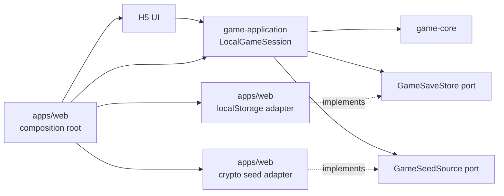
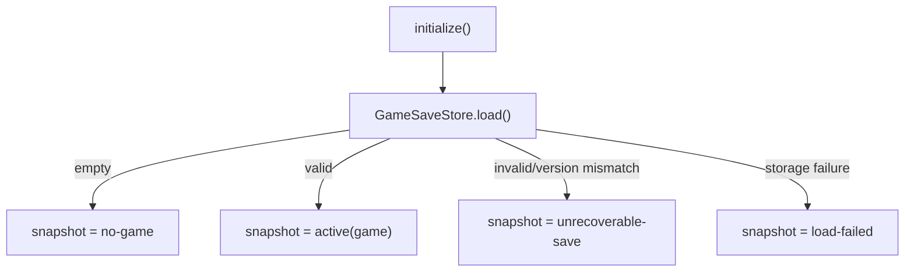
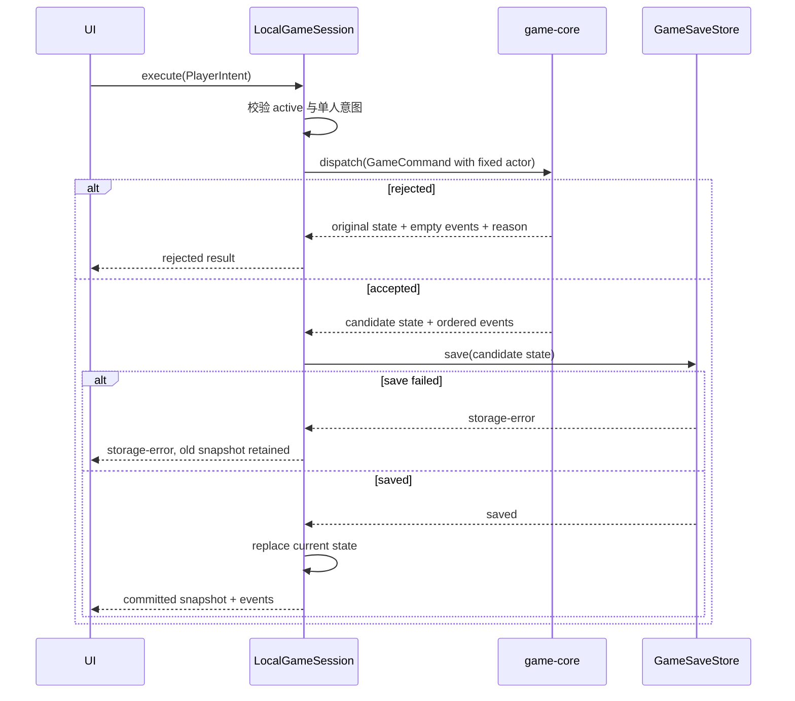

# 本地单人编排层架构

## 范围

v1 是普通浏览器 H5 单人游戏。编排层只负责连接 `game-core`、单槽自动存档和 UI；不建设网络、服务端、账号、房间、PWA 专属能力或 CLI 适配。`game-cli` 仍是独立程序，不属于这条依赖链。

`game-core` 继续保持框架无关、确定性和纯规则边界：

```text
GameState + GameCommand -> TransitionResult
```

接受时返回新状态和有序事件，拒绝时返回原状态、空事件列表和拒绝原因。

## 目标结构

当前仓库只有 core 和独立 CLI；后续浏览器产品按以下结构增加包和应用目录：

```text
packages/
├── game-core/
└── game-application/
    ├── LocalGameSession
    ├── PlayerIntent
    ├── SessionSnapshot
    ├── GameSaveStore port
    └── GameSeedSource port

apps/
└── web/
    ├── composition root
    ├── localStorage adapter
    ├── browser seed adapter
    └── UI
```

依赖方向固定为：



`game-application` 不导入 React、DOM、`window` 或 Web Storage API。UI 可以读取 core 的只读卡片目录和无状态卡片查询；需要读取当前局面的合法操作、敌人状态或反击伤害时，使用 application 提供的只读查询门面。UI 不能直接调用 `dispatch`、替换 `GameState` 或取得存档端口。

## 会话所有权

`LocalGameSession` 是运行中 `GameState` 的唯一事实源。UI 只保留选牌、弹窗、动画进度等表现状态；它拿到的是不可变 `SessionSnapshot`，不是可写的 React 副本。

每个页面实例只由组合根创建一个会话。构造函数无副作用，组合根显式调用一次 `initialize()`，并负责最终销毁会话和取消外部存档监听。

## 会话状态

| 状态                 | 含义                                           | 允许的下一步                   |
| -------------------- | ---------------------------------------------- | ------------------------------ |
| `uninitialized`      | 尚未执行恢复                                   | `initialize`                   |
| `no-game`            | 没有自动存档                                   | `startNewGame`                 |
| `active`             | 有已提交的 `GameState`，可能进行中、胜利或失败 | 单人意图、`replaceWithNewGame` |
| `unrecoverable-save` | 存档存在但 envelope、版本或 core 校验失败      | `clearUnrecoverableSave`       |
| `load-failed`        | 存储暂时无法读取                               | `retryLoad`                    |
| `stale`              | 其他标签页已修改唯一存档                       | 刷新页面恢复                   |

`active.game.status` 负责表达规则层的 `in-progress`、`won` 和 `lost`。胜负不会离开 `active`，最终状态继续占用唯一存档。

普通保存失败不改变状态：当前会话和快照仍保持旧值，操作结果返回 `storage-error`。不可恢复存档也不会被自动删除或覆盖。

## 应用层公开契约

实现后的公开边界如下。所有数组、状态和事件在 UI 侧都是深只读，运行时提交对象也会被冻结：

```ts
type PlayerIntent =
  | { readonly type: 'play-cards'; readonly cardIds: readonly CardId[] }
  | { readonly type: 'yield' }
  | { readonly type: 'discard-for-damage'; readonly cardIds: readonly CardId[] }
  | { readonly type: 'use-solo-jester'; readonly cardId: CardId }

type ReadonlyGameState = DeepReadonly<GameState>

type SessionSnapshot =
  | { readonly status: 'uninitialized' }
  | { readonly status: 'no-game' }
  | { readonly status: 'active'; readonly game: ReadonlyGameState }
  | { readonly status: 'unrecoverable-save'; readonly reason: SaveProblem }
  | { readonly status: 'load-failed'; readonly reason: StorageProblem }
  | {
      readonly status: 'stale'
      readonly previousGame?: ReadonlyGameState
    }

interface GameSaveStore {
  load(): SaveLoadResult
  save(game: ReadonlyGameState): SaveWriteResult
  clear(): SaveClearResult
  onExternalChange(listener: () => void): () => void
}

interface GameSeedSource {
  nextSeed(): string | number
}

class LocalGameSession {
  constructor(store: GameSaveStore, seedSource: GameSeedSource)
  initialize(): InitializeResult
  retryLoad(): InitializeResult
  getSnapshot(): SessionSnapshot
  subscribe(listener: () => void): () => void
  startNewGame(): NewGameResult
  replaceWithNewGame(): NewGameResult
  clearUnrecoverableSave(): ClearSaveResult
  execute(intent: PlayerIntent): ExecuteResult
  dispose(): void
}

function getLegalPlayerIntents(game: ReadonlyGameState): readonly PlayerIntent[]
function getCurrentEnemyStats(game: ReadonlyGameState): {
  readonly attack: number
  readonly health: number
  readonly damage: number
  readonly shield: number
  readonly healthRemaining: number
} | null
function getCounterattackDamage(game: ReadonlyGameState): number
function getEnemyDamage(game: ReadonlyGameState): number
function getEnemyShield(game: ReadonlyGameState): number
function isEnemyImmunityCancelled(game: ReadonlyGameState): boolean
```

UI 确认行为由 UI 自己完成；应用层用不同方法名表达破坏性边界。`startNewGame` 只接受 `no-game`，`replaceWithNewGame` 用于已经确认的替换，`clearUnrecoverableSave` 只清理损坏存档，不顺便开局。

`GameSaveStore.load` 返回 `empty | loaded | unrecoverable | failed`，`save` 返回 `saved | failed`，`clear` 返回 `cleared | failed`。`SaveProblem.code` 固定为 `invalid-envelope`、`unsupported-save-version`、`unsupported-game-version`、`invalid-game-state` 或 `invalid-solo-game`；`StorageProblem.code` 固定为 `unavailable`、`quota-exceeded` 或 `unknown`。

浏览器适配器负责固定 key、JSON envelope、独立存档版本、`GameState.schemaVersion` 检查和首次 `parseGameState` 校验；应用层只依赖端口，不处理原始 key/value。应用层恢复时会再克隆并防御性校验 core 状态，然后检查“恰好一个 ID 为 `local-player` 的玩家，且不处于多人专用的 `choose-next-player` 决策”这一产品不变量。固定 ID 是持久化协议的一部分，但不是 UI 输入。

端口的外部变化通知不得从 `load`、`save`、`clear` 或监听注册的调用栈中重入；浏览器 `storage` 事件天然满足这一点。会话的同步操作 guard 会拒绝 UI 监听器发起的嵌套 mutation。

`GameSeedSource` 在新局创建时提供 seed。H5 实现使用 `crypto.getRandomValues`，测试使用固定 seed；core 和应用服务不调用 `Math.random` 或 `Date.now`。

应用操作结果使用 `status` 判别：初始化和重试成功为 `completed`，创建或执行提交为 `committed`，清理成功为 `cleared`，core 拒绝为 `rejected`，持久化失败为 `storage-error`，会话状态不允许操作时为 `application-rejected`。`ExecuteResult` 的所有失败分支都携带只读空事件元组；只有 `committed` 携带有序、深只读的 core 事件。

## 核心流程

### 初始化恢复



恢复不发布 `GameEvent[]`。有效终局快照照常进入 `active`，UI 显示结算界面。

### 执行玩家意图



保存成功之前，core 的结果只是候选结果。只有保存成功后才替换会话状态；快照订阅者收到状态变化，`GameEvent[]` 仅随本次调用结果交付一次。拒绝、保存失败和恢复都不回放事件。

### 创建和替换

`startNewGame` 固定单人 core 配置：一个稳定的本地玩家 ID、同一 ID 作为起始玩家，以及来自 `GameSeedSource` 的 seed。初始 `GameState` 必须先保存成功，再进入 `active`。

`replaceWithNewGame` 使用同一流程，但只允许替换已有正常存档；保存失败时旧局仍是会话事实。胜负后的替换也必须走这个显式操作。

### 外部标签页变化

H5 适配器监听唯一存档 key 的 `storage` 事件。会话收到外部变化后进入 `stale`，停止接受意图和写入，UI 提示刷新；v1 不做标签页同步、合并或冲突解决。

## UI 集成规则

UI 通过 `getSnapshot()` 首次读取，通过 `subscribe()` 感知快照失效，再调用会话门面的方法。一次性事件由发起 `execute` 的控制器按序消费；订阅本身不产生历史事件。

选择、确认替换、损坏存档清理、错误提示和动画进度都是 UI 状态。UI 不直接修改快照，不把选中牌写入存档，也不绕过应用层提前更新规则局面。

## 测试契约

`game-application` 使用 fake `GameSaveStore` 和固定 `GameSeedSource` 做同步单元测试，至少覆盖：

- 空槽初始化、有效恢复、版本/解析失败、读取失败和显式清理。
- 接受命令的保存先于状态替换和事件交付。
- 保存失败保留旧状态；core 拒绝不写存档、不产生事件。
- 首次新局、已存档替换、胜负终局恢复和单人意图映射。
- 外部存档变化进入 `stale`，之后意图全部被拒绝。
- 固定 seed 产生可重复的初始状态。

浏览器适配器单独测试 JSON envelope、版本检查、`parseGameState`、Web Storage 异常和外部 `storage` 通知。UI 测试只验证快照渲染、确认流程和事件表现，不重复测试 core 规则。

## 明确不做

- 网络、服务端权威状态、身份、房间、观众、同步协议。
- PWA 安装、Service Worker、离线资源缓存。
- CLI 改造或把 CLI 当作浏览器适配器。
- 多存档槽、手动检查点、事件溯源、事件回放。
- 多标签页实时同步、合并或自动解决冲突。
